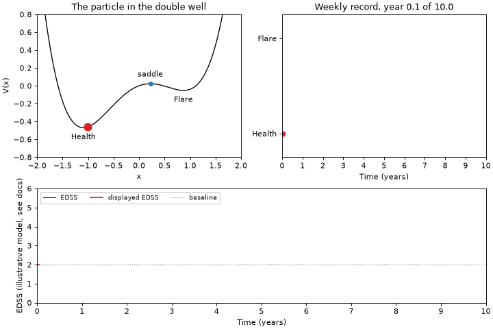

# msrelapse

A reference implementation of the stochastic double-well model of
relapsing-remitting multiple sclerosis published by Bordi, Umeton and
co-authors in 2013. The package holds the potential and the stochastic
equation of the article, a seeded simulator, the duration fits and
memorylessness tests the article does not report, a virtual cohort generator
that writes registry-shaped relapse tables, and a command line that reproduces
the published numbers end to end.

> In 70 untreated relapsing-remitting MS patients, relapse and remission
> durations are both exponentially distributed (means about 4.3 and about 100
> weeks) with no detectable periodicity, so relapse onset is a memoryless
> process. A noise-driven asymmetric double-well model reproduces this, and the
> ratio of the logarithms of the two mean durations estimates the ratio of the
> two barrier heights (about 3). Bordi, Umeton et al., Int J Genomics 2013,
> doi:10.1155/2013/910321.



The three panels are one simulated record of 520 weeks: the particle moving
between the health and flare wells of the asymmetric double well, the weekly
series of flare and remission weeks that path produces, and an illustrative
EDSS trajectory the same series drives, the first two at the asymmetry and the
noise calibrated to the two mean durations the article reports, about 100 weeks
in remission and about 4.3 weeks in relapse, although the episodes drawn run
longer than those two means, since the calibration times the passage from the
bottom of a well to the saddle and every week the path touches the flare state
counts as a whole flare week. The bottom panel is an extension and not part of
the article, which reports no disability score for any of its patients. It
opens at a baseline of 2.0 after the first attack, gives every flare a nadir
deficit drawn from the published distribution and mostly recovered within six
months, and leaves a residual of at least 0.5 after 42 percent of them, every
number of it taken from the literature with its source. The record drawn here
is one draw of that model and not a typical one. Its first two flares come a
week apart and both recover in full, so together they leave one spike and the
slow decay after it and nothing more; the third settles half a point below the
score the record opened at; and the last two leave half a point each, which is
where the trace ends after ten years.
[Disability trajectory](disability.md) explains the model, the evidence behind
it and what it cannot do, and no trace it draws is a prognosis.
[Reproducing the paper](reproducing.md) has the command that writes the
animation.

!!! warning "The records shipped here are synthetic"

    The clinical series behind the article was never released. What this
    package ships is a synthetic twin generated from the numbers the article
    prints, and no clinical claim can be read off it or off any figure drawn
    from it. [Data](data.md) says what the files are and how to ask the
    corresponding authors for the original series.

## Who this is for

| Audience | What they need | Entry point |
|---|---|---|
| Mathematical biologists | The stochastic equation, the potential, Kramers and first passage times, a simulator with seeds | `msrelapse.model`, `msrelapse.simulate` |
| Trial statisticians | Exponential and geometric fits with censoring, memorylessness tests, the Poisson to negative binomial mapping, annualised relapse rates with intervals | `msrelapse.fit`, `msrelapse.stats` |
| In-silico trial and digital twin groups | A calibrated virtual cohort generator that emits relapse event tables in registry format | `msrelapse.cohort`, `msrelapse.io` |

Every one of those entry points documents the article it comes from, and every
result object carries its citation, so that a number copied out of a session
can be traced back to the source. [Citing](citing.md) has the reference and the
BibTeX entries.

## Installation

There has been no release yet, so until the first one the package installs from
a clone of the repository:

```bash
git clone https://github.com/renato-umeton/multiple-sclerosis-modeling-bordi
cd multiple-sclerosis-modeling-bordi
uv sync --all-extras
uv run --all-extras pytest
```

From the first release on it will install from PyPI as well:

```bash
uv add msrelapse          # in a uv project
pip install msrelapse     # anywhere else
```

The core install needs numpy, scipy and pandas only. Two extras are available:

```bash
pip install "msrelapse[plot]"   # matplotlib, for msrelapse.plots
pip install "msrelapse[fast]"   # numba, for the compiled integration kernels
pip install "msrelapse[all]"    # both
```

Neither extra changes a result. Without `plot` every function that draws raises
with the name of the extra to install; without `fast` the same integration runs
in numpy.

## Quick start

```python
import msrelapse as ms

weekly = ms.load_synthetic_bordi2013()                      # 70 synthetic records
runs = ms.weekly_to_durations(weekly)                       # run length encoding
relapse = ms.fit_durations(runs, state=ms.PAPER.state_no_health.value)
health = ms.fit_durations(runs, state=ms.PAPER.state_health.value)
beta, sigma = ms.calibrate(health.mean, relapse.mean)       # equation (4)
well = ms.DoubleWell(alpha=ms.PAPER.alpha_reference.value, beta=beta)
print(well.barriers(), well.barrier_ratio())                # the two barriers
simulated = ms.simulate_weekly(well, sigma, n_weeks=520, n_paths=5, rng=0)
print(ms.weekly_to_durations(simulated).head())             # the simulated runs
print(ms.reproduction_table(weekly))                        # the closing table
```

`fit_durations` corrects for the final remission that the end of follow up cut
short, which the article did not; pass `censoring=False` for the naive mean it
reported. [Reproducing the paper](reproducing.md) walks through the difference.

## Command line

Installing the package installs one command, `msrelapse`, with eight
subcommands. Each of them prints its own help.

| Subcommand | What it does |
|---|---|
| `msrelapse reproduce` | Measures every quantity the article reports on one weekly record, writes `numbers.json`, the record and the figures, and prints the closing table |
| `msrelapse simulate` | Generates a virtual cohort and writes it as a CSV file in any of the three schemas |
| `msrelapse animate` | Writes the animation above, one simulated record on the calibrated potential, as a GIF file |
| `msrelapse fit` | Fits the duration law of one or both states of a durations CSV |
| `msrelapse test-memoryless` | Tests whether the durations of a state carry no memory |
| `msrelapse test-periodicity` | Looks for a period in the relapse onsets of a weekly record and pools the evidence |
| `msrelapse cite` | Prints the article and this package as a reference and as BibTeX |
| `msrelapse params` | Prints every number the article reports, with its unit and its source |

A first run needs no arguments and no data of its own:

```bash
msrelapse reproduce --out reproduction/
```

## Where to go next

- [Theory](theory.md) derives every equation the package implements, from the
  potential to the negative binomial relapse counts, and says which choices are
  the article's and which are this package's.
- [Disability trajectory](disability.md) documents the illustrative EDSS
  extension behind the bottom panel of the animation: the model, the published
  value under each of its parameters, the anchors it was checked against, and
  everything it cannot be used for.
- [Reproducing the paper](reproducing.md) is the reproduction path: the command,
  what it writes, the closing table and its tolerances, the four notebooks, and
  the inconsistencies in the article that a reproduction runs into.
- [Data](data.md) describes the synthetic twin and the three schemas.
- [Paper facts](paper_facts.md) is the verified transcription of the article,
  equation by equation and figure by figure, which the package is checked
  against.
- The API pages document every module, generated from the docstrings.
